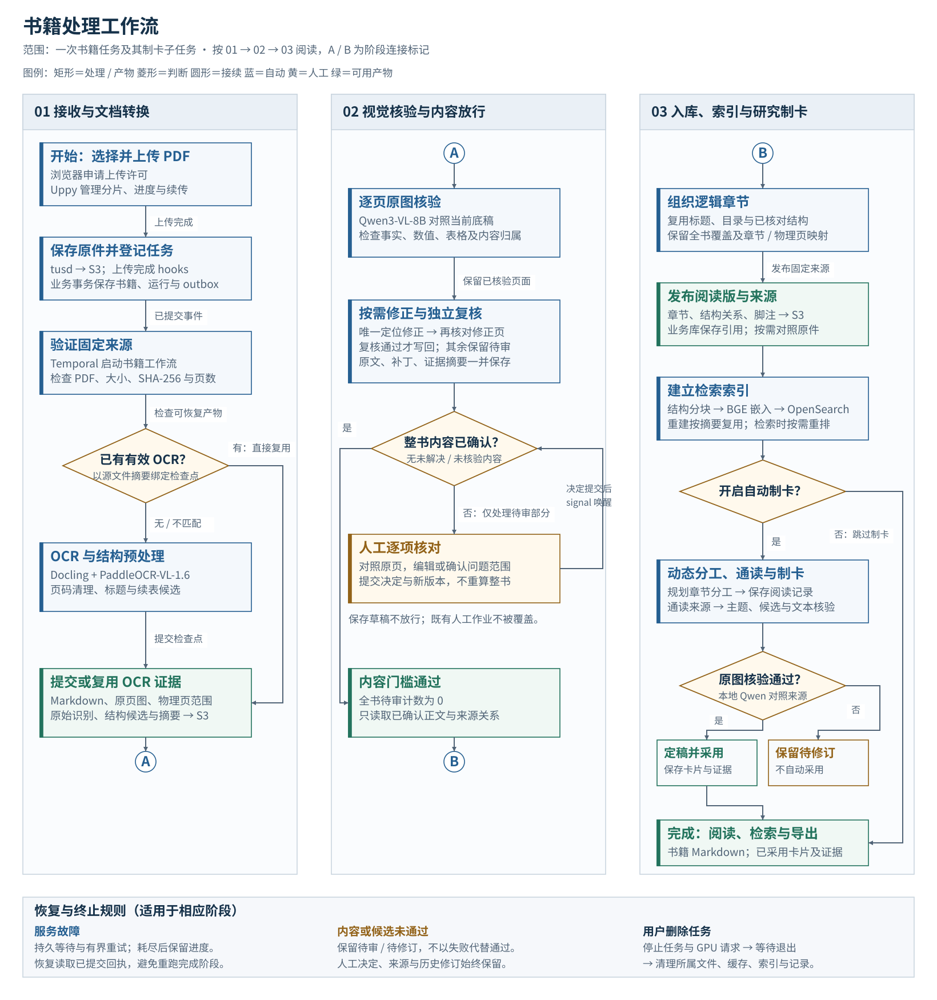
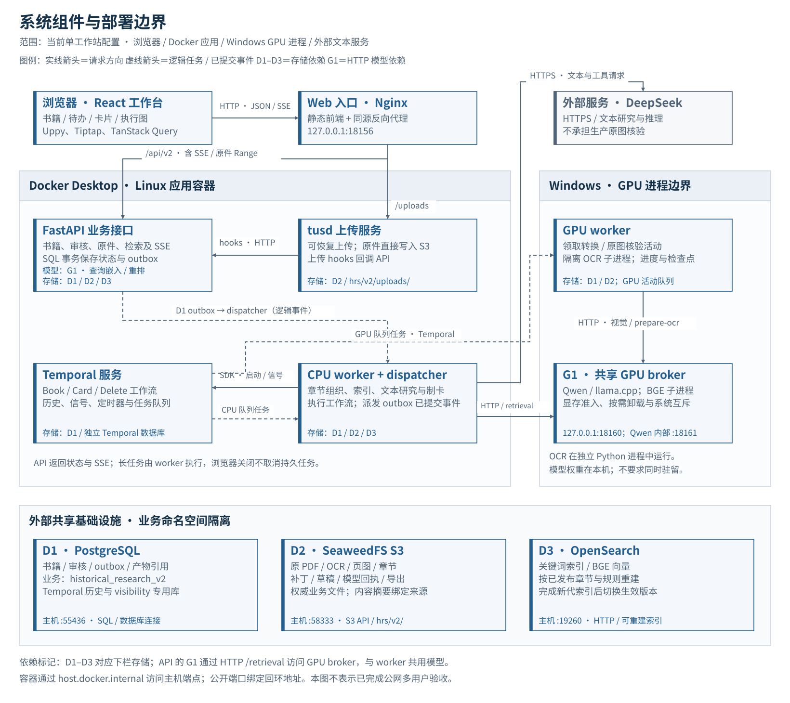

<div align="center">

# Historical Research System

**历史研究系统 · 从扫描书籍到有出处的研究卡片**

[](https://github.com/TexcolCloud/historical-research-system/actions/workflows/engineering.yml)
[](services/research-platform/pyproject.toml)
[](services/review-workbench/package.json)

[功能](#功能) · [工作流程](#工作流程) · [快速开始](#快速开始) · [开发与验证](#开发与验证) · [文档](#文档)

</div>

面向历史文献的书籍研究工作台。上传扫描 PDF，完成 OCR 与原件核对，按章节阅读、检索原文，并生成保留引文、页码和核验记录的史料卡。

系统围绕**一本书及其处理任务**组织操作：机器负责识别、核对和研究，人只处理无法自动确认的内容。原始材料、修订记录与研究结论分开保存，研究卡片可以回查原书。

> **项目状态：持续开发与交付验收中。** 当前部署配置面向 Windows NVIDIA GPU 主机与 Docker Desktop。自动化检查覆盖工程行为，不能代替真实整书的内容验收；尚不提供经过完整验收的公网多用户部署方案。

## 功能

| 能力             | 使用方式                                                                                     |
| ---------------- | -------------------------------------------------------------------------------------------- |
| 书籍任务管理     | 上传 PDF、查看阶段与进度、恢复失败任务；删除运行中的任务时先终止处理，再清理所属数据和文件。 |
| 提取与原件核对   | 简单可靠的 PDF 文字页直接提取并规则核验；其余页经 Docling + PaddleOCR-VL-1.6 和本地 Qwen3-VL-8B 原图核验。 |
| 有依据的自动修正 | 唯一定位的修正经独立原图复核通过后写回；不确定、不可读或复核失败的内容交人工处理。           |
| 章节阅读         | 以逻辑章节阅读 Markdown，按需对照物理页；展示标题层级、跨页表格与续段关系，保留脚注链接。    |
| 来源可追溯的检索 | 关键词与向量混合召回、本地 BGE 重排；返回原文范围、表头、脚注及相邻上下文。                  |
| 动态研究制卡     | Agent 基于完整章节分工阅读和规划主题，生成带引文、事实归属、日期依据与研究限制的卡片。       |
| 执行过程与导出   | 查看实际主 Agent、子 Agent、组件及工具关系；导出书籍 Markdown 和带完整结构记录的卡片。       |

## 工作流程

[](assets/diagrams/book-workflow.svg)

按编号从左到右阅读，各阶段内部从上到下；同名圆形连接符接续流程。点击图片可查看全尺寸。

- **入库前完成整书内容核对。** 审核工作区可以阅读已识别的内容，但未解决、未核验内容不能绕过入库和分块门槛。
- **草稿保存不等于放行。** 人工决定和草稿不会被机器覆盖；文章结构不额外增加人工批准步骤。
- **制卡核验通过后自动采用。** 不增加常规人工确认；未通过的卡片保留为待修订状态。制卡通读完整来源，不用 Top-K 检索代替通读。
- **不因规范化丢失证据。** 可接受不改变含义的繁简、标点和文字修正，仍须保留人名、地名、时间、数量、事实及引语／注释归属。

只需要入库、阅读和检索时，在根 `.env` 设置 `PLATFORM_AUTO_CARDS_ENABLED=false`，并重启 API 与 CPU worker。默认开启自动制卡；该设置不会撤销已创建的制卡任务。

## 架构

[](assets/diagrams/system-architecture.svg)

箭头标明请求或任务方向，边框划分运行边界，D1–D3 标明存储依赖。图示约定和实现依据见[制图说明](assets/diagrams/README.md)。

| 层次     | 现有组件与职责                                                                                         |
| -------- | ------------------------------------------------------------------------------------------------------ |
| 前端     | React、React Router、TanStack Query；Uppy 上传、Tiptap 编辑、React Flow + Dagre 执行图。               |
| 业务接口 | FastAPI、Pydantic、SQLAlchemy、Alembic；OpenAPI 生成 TypeScript 客户端。                               |
| 任务执行 | Temporal 管理书籍流程、子任务与等待；CPU worker 处理章节和文本研究，GPU worker 运行 OCR／视觉阶段。    |
| 模型调度 | OCR、Qwen 视觉与 GPU 检索通过共享 broker／互斥机制协调；按阶段切换模型，不要求所有权重同时驻留。       |
| 持久化   | PostgreSQL 保存状态和引用；S3 保存原件、OCR、页图、章节、草稿、回执与导出；OpenSearch 保存可重建索引。 |

业务文件以 S3 为权威存储。本地保留模型、诊断日志和可恢复计算缓存，不作为业务文件的唯一副本。现役平台不自动迁移旧业务命名空间的数据。

**模型分工：** PaddleOCR-VL-1.6 负责识别；Qwen3-VL-8B-Instruct Q4_K_M 负责原图核对；DeepSeek 负责文本研究与推理；BGE-M3 与 BGE-reranker-v2-m3 负责嵌入和重排。生产视觉核验不回退到 DeepSeek，也不依赖 Codex 或 GPT 开发评审。

## 快速开始

以下命令在 **Windows PowerShell、项目根目录**执行。它们使用现有部署入口，不会安装全部基础设施；首次运行请先完成前置准备。

### 1. 准备环境

| 项目     | 要求                                                                                                                    |
| -------- | ----------------------------------------------------------------------------------------------------------------------- |
| 系统     | Windows + Docker Desktop（Linux containers），可用的 NVIDIA 驱动。当前 GPU 启动器不支持直接在 Linux／macOS 上运行。     |
| GPU      | 当前按 16 GB 显存工作站配置，OCR 默认预算为 15 GB。实际峰值受页面、上下文和模型切换影响，不保证所有输入都使用相同显存。 |
| 工具     | Git、[uv](https://docs.astral.sh/uv/getting-started/installation/)、Python 3.11；前端本地开发另需 Node.js 24+。         |
| 存储服务 | 可创建专用数据库的 PostgreSQL、已有 S3 bucket、OpenSearch。Compose 使用 `host.docker.internal` 连接宿主服务。           |
| 文本模型 | 可用的 DeepSeek API 凭据；本地 OCR／视觉不等于整条研究流程完全离线。                                                    |

默认外部存储端口是 PostgreSQL **55436**、SeaweedFS S3 **58333**、OpenSearch **19260**。数据库用户、端口与凭据须与 [Compose 配置](deploy/platform/compose.yml) 一致；调整部署时同时核对容器端和主机端地址。

```powershell
git clone https://github.com/TexcolCloud/historical-research-system.git
cd historical-research-system

# 已有配置时保留，逐项补齐，不覆盖密钥。
if (-not (Test-Path .env)) { Copy-Item .env.platform.example .env }

```

编辑 `.env`，将所有 `CHANGE_ME` 替换为真实配置，并确认文本模型选择。当前模板显式选择 Pro 推理模型；需要统一使用 Flash 时，将 `CARDS_REASONING_MODEL` 和 `CARDS_READING_MODEL` 均设为 `deepseek-flash`。主机与容器的配置优先级见 [平台配置](services/research-platform/README.md#运行与配置)。原件、真实配置、模型权重和业务存储数据不包含在仓库中。

### 2. 安装 OCR、平台环境与模型

```powershell
# OCR 使用独立环境；安装结束会执行识别后端检查，可能下载权重并使用 GPU。
$env:UV_PROJECT_ENVIRONMENT="$PWD/services/document-extraction/.venv"
.\deploy\windows\bootstrap.ps1

# 平台与 GPU 检索使用另一环境。
$env:UV_PROJECT_ENVIRONMENT="$PWD/.cache/engineering-envs/research-platform"
uv sync --project services/research-platform --locked --group dev --extra retrieval

# 下载固定版本的 Qwen 视觉权重、投影器与 Windows llama.cpp 运行时。
.cache/engineering-envs/research-platform/Scripts/python.exe scripts/setup_local_vision.py
```

继续按 [本地模型准备](models/README.md) 安装固定版本的 BGE 嵌入／重排权重。模型体积较大，首次下载和初始化不计入正常书籍处理时间；不要在现有书籍占用 GPU 时重新执行模型初始化检查。

### 3. 初始化并启动

确认外部存储服务已运行、S3 bucket 已创建且模型准备完成后执行：

```powershell
.cache/engineering-envs/research-platform/Scripts/python.exe scripts/hrs_v2.py init
.cache/engineering-envs/research-platform/Scripts/python.exe scripts/hrs_v2.py up --build
```

`init` 创建独立的业务、测试和 Temporal 数据库，补充平台连接配置并应用迁移，不重置已有数据库。`up` 先迁移，再启动 Docker 应用和本机 GPU 进程；**保持该终端运行**。

打开 **[http://127.0.0.1:18156/](http://127.0.0.1:18156/)**。`/platform.html` 是同一工作台入口。容器构建已包含前端依赖安装，无需另开 Vite 才能使用网页。

### 4. 处理第一本书

1. 在书籍页上传 PDF，进入该书的处理进展。
2. 等待 OCR 和本地视觉核验；有待办时，在内容核对页查看原件、修订或确认对应问题。
3. 全部必审内容处理完后，系统组织章节、入库并建立索引，可在阅读全文和检索本书中查看结果。
4. 开启自动制卡时，系统继续研究制卡；通过任务运行查看实际分工，通过史料卡回查引文和原件。

### 5. 检查与停止

在另一个终端、项目根目录执行：

```powershell
.cache/engineering-envs/research-platform/Scripts/python.exe scripts/hrs_v2.py status
.cache/engineering-envs/research-platform/Scripts/python.exe scripts/hrs_v2.py doctor
.cache/engineering-envs/research-platform/Scripts/python.exe scripts/hrs_v2.py stop
```

`doctor` 检查存储、worker 和 broker，不加载模型或批准内容。`stop` 等待受启动器管理的 GPU 进程退出后停止应用服务；日志位于 `.cache/platform-diagnostics/`。完整运维说明见 [平台文档](services/research-platform/README.md)。

## 开发与验证

主程序位于 `services/research-platform` 和 `services/review-workbench`。运行单独的转换 CLI 时使用 `services/document-extraction` 环境；不要混用平台与 OCR 依赖环境。

```powershell
# 在项目根目录；平台 Python 环境已按上文安装。
npm --prefix services/review-workbench ci
npm --prefix services/review-workbench/tooling/openapi ci
npm --prefix services/review-workbench run contracts
npm --prefix services/review-workbench test
npm --prefix services/review-workbench run check-unused
npm --prefix services/review-workbench run build

.cache/engineering-envs/research-platform/Scripts/python.exe -m ruff check services/research-platform/src scripts/hrs_v2.py
```

后端集成测试需要独立的 `historical_research_v2_test` 数据库和测试 S3／OpenSearch。使用 [测试 Compose](deploy/platform/compose.test.yml) 与 [CI 中的测试环境变量及命令](.github/workflows/engineering.yml)，不要将测试指向业务存储。涉及模型和 Temporal 的 opt-in 测试需额外准备对应服务；未开启的测试不等于已验证。

前端调试可运行 `npm --prefix services/review-workbench run dev`，默认占用 18156；它不能与生产 Web 同时占用此端口。代理配置见 [vite.config.ts](services/review-workbench/vite.config.ts)。提交接口变更时同步生成 OpenAPI 和 TypeScript 契约。

## 项目结构

```text
services/
  research-platform/     # 现役业务 API、领域规则、工作流、迁移与测试
  review-workbench/      # React 书籍工作台
  document-extraction/   # 独立 OCR / 文档转换与本地视觉核验
packages/
  runtime-support/       # 共用 Python 包，不是独立服务
evaluation/
  reference/             # 冻结评测参考资源，不进入生产内容流
deploy/
  platform/              # 应用 Compose、Dockerfile、代理与测试基础设施
  windows/               # OCR 环境与 GPU 检查脚本
  infrastructure/        # PostgreSQL / S3 / OpenSearch，共享数据卷
scripts/                 # 平台启动、诊断、模型安装及评测入口
models/                  # 本地权重与缓存；大文件不入 Git
```

## 文档

| 主题                       | 入口                                                                                                                                         |
| -------------------------- | -------------------------------------------------------------------------------------------------------------------------------------------- |
| 部署、审核、恢复与后端接口 | [Research Platform](services/research-platform/README.md)                                                                                    |
| 前端开发与交互规则         | [Review Workbench](services/review-workbench/README.md)                                                                                      |
| OCR CLI 与转换产物         | [Document Extraction](services/document-extraction/README.md)；当前默认 [default.json](services/document-extraction/config/default.json)     |
| 模型准备与目录             | [Local Models](models/README.md)                                                                                                             |
| API 契约                   | [OpenAPI](services/research-platform/openapi.json)                                                                                           |
| 检索评测与已知限制         | [检索与来源](services/research-platform/README.md#检索与来源)、[Ragas 操作说明](services/research-platform/evaluation/tools/ragas/README.md) |
| 自动化检查                 | [GitHub Actions](https://github.com/TexcolCloud/historical-research-system/actions/workflows/engineering.yml)                                |

文档按“入门 → 操作指南 → 参考与限制”组织：根 README 提供安装和首次使用，模块 README 解释当前职责、日常操作及验证。各级 `docs/`、历史调优与验收报告、`output/` 及个人开发指令留在本地，不随 Git 分发；保留的操作说明不依赖这些本地资料才能阅读。API 契约、配置示例、测试资源、依赖锁与第三方许可证继续随仓库保存。

共享基础设施统一放在 `deploy/infrastructure/`，保留原 Compose 项目名、服务名与卷定义：

- [PostgreSQL 与 S3](deploy/infrastructure/compose.storage.yml)，以及同目录初始化 SQL。
- [OpenSearch 与快照卷](deploy/infrastructure/compose.search.yml)。

目录迁移不会改名或重建现有数据卷。`document-ingestion`、`document-retrieval`、`research-cards` 已没有现役服务入口，不再保留同名服务目录；历史代码从 Git 记录追溯。现役回归与 Ragas 工具位于 `services/research-platform`，未入 Git 的历史资料与生成残留不会成为运行依赖。

## 常见问题

<details>
<summary>为什么 clone 后不能只运行 docker compose up？</summary>

当前 Compose 复用外部 PostgreSQL、SeaweedFS S3 和 OpenSearch，OCR／视觉在 Windows GPU 主机运行。它不是包含全部基础设施、权重和凭据的一键镜像。先完成快速开始中的环境、模型与初始化步骤。

</details>

<details>
<summary>为什么有些内容能读，但书籍还没有入库？</summary>

OCR 底稿和已核对部分可以在审核工作区阅读。只有整书必审内容全部解决，才会进入正式章节组织、入库和检索分块。保存草稿、服务健康或机器完成某一页都不代表整书通过。

</details>

<details>
<summary>这是完全离线的系统吗？</summary>

OCR、视觉核验和 BGE 检索模型在本地运行；章节组织与文本研究使用配置的 DeepSeek 服务，会发送相应文本。模型初次下载也需要网络。部署前应根据材料使用要求选择合适的运行环境。

</details>

<details>
<summary>可以直接部署到公网吗？</summary>

当前配置只发布回环端口，面向单工作站使用。公网鉴权、多用户隔离与全项目边界验收尚未完成，不应把当前配置视为已验收的公共服务模板。

</details>

## 贡献与反馈

通过 [Issues](https://github.com/TexcolCloud/historical-research-system/issues) 提交问题，附上复现步骤、期望／实际行为、运行版本和脱敏日志。内容问题优先提供可公开的最小样本、物理页码和准确范围；不要提交密钥、私人材料或业务数据库。

提交 PR 前查找现有实现与调用方，优先复用组件，清理本次替换后失效的路径，并执行相关测试和构建。原件证据、字符范围、人工决定及恢复行为是需要保留的有效约定。

## 许可证与依赖

当前仓库尚未提供项目级 `LICENSE` 文件，不声明 MIT、Apache-2.0 等授权。各第三方组件和模型遵循其各自许可证；书籍与扫描件的使用权限须单独确认。

感谢项目使用的开源基础设施：[Docling](https://github.com/docling-project/docling)、[PaddleOCR](https://github.com/PaddlePaddle/PaddleOCR)、[Qwen3-VL](https://github.com/QwenLM/Qwen3-VL)、[llama.cpp](https://github.com/ggml-org/llama.cpp)、[FlagEmbedding](https://github.com/FlagOpen/FlagEmbedding)、[Temporal](https://github.com/temporalio/temporal)、[SeaweedFS](https://github.com/seaweedfs/seaweedfs)、[OpenSearch](https://github.com/opensearch-project/OpenSearch)、[Uppy](https://github.com/transloadit/uppy) 与 [React Flow](https://github.com/xyflow/xyflow)。
